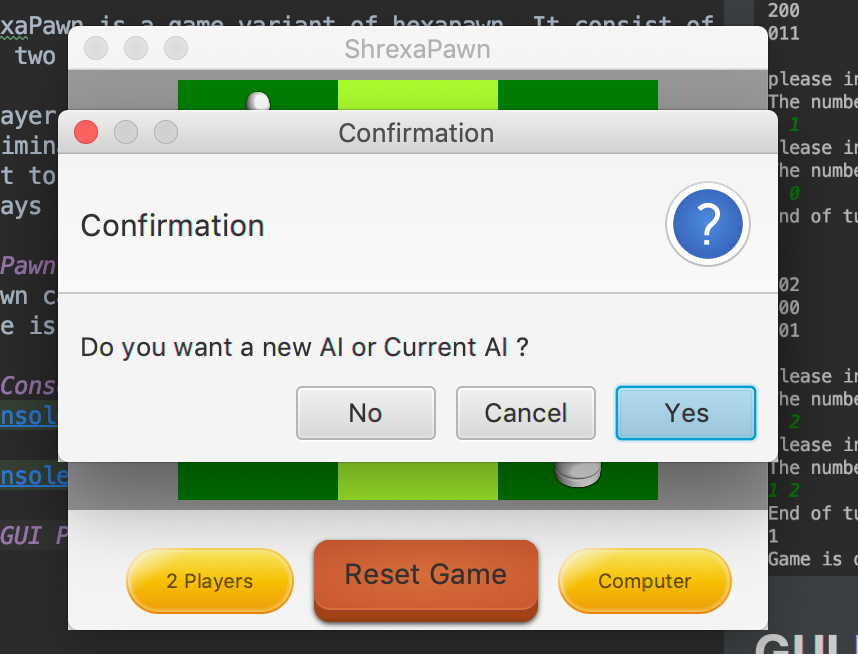

# ShrexaPawn

ShrexaPawn is a game variant of hexapawn. It consist of a game board of 9 squares 
with two players each having 3 pawns which the utilise to win the game.

A player wins the game by either, 
- Eliminating all the opponent's pawns,
- Get to the opponents base
- Plays in such a way that causes the opponent not to have a valid move.

### Pawn Movement
A pawn can only move forward if the cell is empty or diagonally if the opponent's
piece is in the cell.

### AI implementation
A hash map was used as the brain of the AI. Each map element
is made up of a string (the board state) and an ArrayList
which holds the valid moves. Each time the computer looses, 
the most recent move is removed from the array list to show it was a bad move.
When the computer wins, the winning move is doubled to increase its chances
of being picked next round.
When game is over, the memory is automatically written to a file.
Loading from a file is also possible.

### Console play 

### GUI Play

